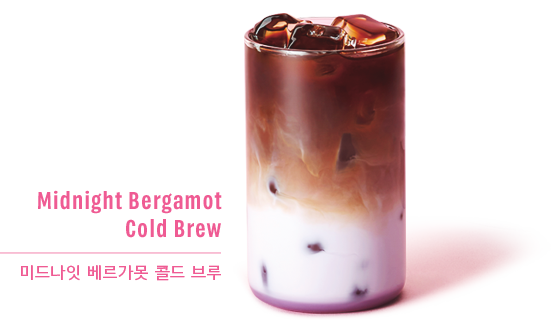

[](https://aw0605.github.io/STARBUCKS/)

## 오픈 그래프 설정
소셜 미디어 공유 시, 활용 정보 지정
```html
<meta property="og:type" content="website" />
<meta property="og:site_name" content="Starbucks" />
<meta property="og:title" content="Starbucks Coffee Korea" />
<meta property="og:description"
      content="스타벅스는 세계에서 가장 큰 다국적 커피 전문점으로, 64개국에서 총 23,187개의 매점을 운영하고 있습니다."/>
<meta property="og:image" content="./images/starbucks_seo.jpg" />
<meta property="og:url" content="https://starbucks.co.kr" />
```

## 트위터 카드 설정
소셜 미디어 공유 시, 활용 정보 지정
```html
<meta property="twitter:card" content="summary" />
<meta property="twitter:site" content="Starbucks" />
<meta property="twitter:title" content="Starbucks Coffee Korea" />
<meta property="twitter:description"
      content="스타벅스는 세계에서 가장 큰 다국적 커피 전문점으로, 64개국에서 총 23,187개의 매점을 운영하고 있습니다."/>
<meta property="twitter:image" content="./images/starbucks_seo.jpg" />
<meta property="twitter:url" content="https://starbucks.co.kr" />
```

## 파비콘 설정
웹 페이지 로고 설정  
- 루트 경로에 `favicon.ico` 위치 시, 자동으로 로딩되어 `<link />`로 연결 필요X
- `favicon.png` 사용 시, `<link />`로 연결 필요
```html
<link rel="icon" href="favicon.png">
```
 favicon.ico - 64X64/32X32/16X16(px)  
 favicon.png - 500
 
 ## Reset
 브라우저 기본 스타일 초기화  
 [jsDELIVR](https://www.jsdelivr.com/package/npm/the-new-css-reset)
 ```html
<link rel="stylesheet" href="https://cdn.jsdelivr.net/npm/the-new-css-reset@1.5.1/css/reset.min.css">
```

## Google Material Icons
페이지에서 사용할 Icon 지정
> 선언
```html
<link rel="stylesheet" href="https://fonts.googleapis.com/icon?family=Material+Icons">
```
> 사용
```html
<div class="material-icons">upload</div>
```

## Lodash - scroll 함수 제어
javascript 라이브러리 중 하나로 데이터의 필수 구조를 쉽게 다룰 수 있도록 도움  
lodash 플러그인 설치해 사이트가 무거워 질 수 잇는 부분 제어  
[lodash cdn](https://cdnjs.com/libraries/lodash.js)

## gsap - 애니메이션 효과
타임라인 기반 애니메이션 라이브러리  
[gsap cdn](https://cdnjs.com/libraries/gsap)

## ScrollMagic
스크롤과 요소 간의 상호작용을 위한 javascript 라이브러리  
[ScrollMagic cdn](https://cdnjs.com/libraries/ScrollMagic)
```javascript
const spyEls = document.querySelectorAll("section.scroll-spy");
spyEls.forEach(function (spyEl) {
  new ScrollMagic.Scene({
    triggerElement: spyEl,
    triggerHook: 0.8,
  })    
    .setClassToggle(spyEl, "show")
    .addTo(new ScrollMagic.Controller());
});
```

## Swiper Slider
> css
```css
<link rel="stylesheet" href="https://unpkg.com/swiper@8/swiper-bundle.min.css"/>
<script src="https://unpkg.com/swiper@8/swiper-bundle.min.js"></script>
```
> html
```html
<!-- Slider main container -->
<div class="swiper">
  <!-- Additional required wrapper -->
  <div class="swiper-wrapper">
    <!-- Slides -->
    <div class="swiper-slide">Slide 1</div>
    <div class="swiper-slide">Slide 2</div>
    <div class="swiper-slide">Slide 3</div>
    ...
  </div>
  <!-- If we need pagination -->
  <div class="swiper-pagination"></div>

  <!-- If we need navigation buttons -->
  <div class="swiper-button-prev"></div>
  <div class="swiper-button-next"></div>

  <!-- If we need scrollbar -->
  <div class="swiper-scrollbar"></div>
</div>
```
> javascript - swiper option
```javascript
new Swiper('변경 .swiper', {
    direction: 'horizontal', //방향
    loop: true, //무한반복
    autoplay : true, //자동시작
    slidesPerView: 4, //한 번에 보여지는 슬라이드 개수
    spaceBetween: 30, //슬라이드와 슬라이드 간격
    navigation : {
        prevEl : "변경 .swiper-prev",
        nextEl : "변경 .swiper-next"
    },
    breakpoints: { //반응형 조건 속성
    320: { //320 이상일 경우
      slidesPerView: 1, //레이아웃 1열
    },
    768: {
      slidesPerView: 3, //레이아웃 3열
    },
    1024: {
      slidesPerView: 4, //레이아웃 4열
    },
  }
});
```

## 검색창 - 클릭 시, 변화
> html
```html
<div class="search">
         <input type="text">
         <span class="material-icons">search</span>
</div>
```
> css
```css
header .search{
    height: 34px;
    position: relative;
}
header .search input{
    width: 36px;
    height: 34px;
    border: 1px solid #ccc;
    font-size: 12px;
    color: #777;
    padding: 10px;
    border-radius: 5px;
    background: #fff;
    transition: width .4s;
}
header .search input:focus{
    width: 190px;
    border-color: #000;
}
header .search .material-icons{
    position: absolute;
    font-size: 30px;
    top: 2px;
    right: 2px;
    transition: opacity .4s;
}
header .search.focused .material-icons{opacity: 0;}
```
> javascript
``` javascript
const searchEl = document.querySelector('.search');
const searchInputEl = searchEl.querySelector('input');

//.focused 추가
searchInputEl.addEventListener('focus',function(){
    searchEl.classList.add('focused');
    searchInputEl.setAttribute('placeholder','통합검색');
});

searchEl.addEventListener('click',function(){
    searchInputEl.focus();
});

//.focused 삭제
searchInputEl.addEventListener('blur',function(){
    searchEl.classList.remove('focused');
    searchInputEl.setAttribute('placeholder','');
});
```

## 순차적 등장
> html
```html
<section class="visual">
        <div class="inner">
            <div class="title fade-in">
                
            </div>
            <div class="fade-in">
                
            </div>
            <div class="fade-in">
                
            </div>
            <div class="fade-in">
                
            </div>
            <div class="fade-in">
                <a href="javascript:void(0)" class="btn btn--pink">자세히 보기</a>
            </div>
        </div>
    </section>
```
> css
```css
.visual .fade-in{opacity: 0;}
```
> javascript
```javascript
const fadeEl = document.querySelectorAll('.visual .fade-in');
fadeEl.forEach(function(fadeEl,index){
    gsap.to(fadeEl,1,{
        delay : (index + 1)*0.7,
        opacity : 1
    });
});
```

## 올해 년도 구하기
```javascript
const thisYear = document.querySelector('.this-year');
thisYear.textContent = new Date().getFullYear();
```
